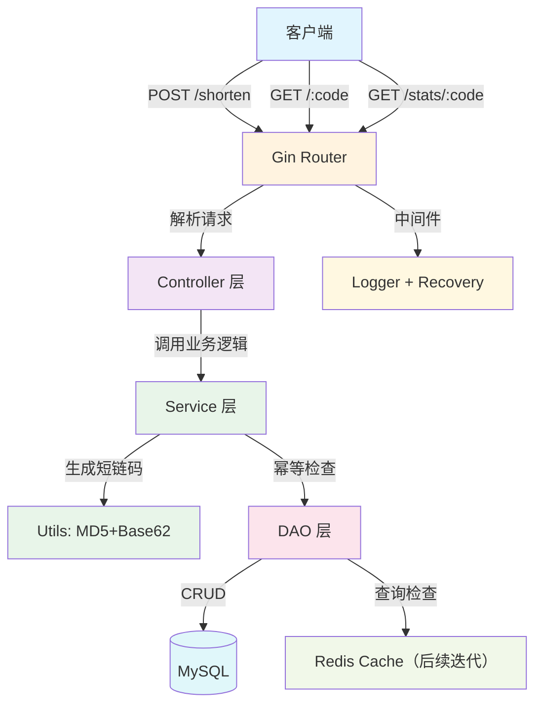

# Short-URL Service · Go 短链接服务

> 一个基于 Go + Gin + GORM + MySQL 的高性能短链接生成服务

[](https://golang.org)
[](https://gin-gonic.com)
[](LICENSE)
[](http://makeapullrequest.com)

---

## 目录

- [项目背景](#项目背景)
- [核心功能](#核心功能)
- [技术架构](#技术架构)
- [技术栈](#技术栈)
- [快速启动](#快速启动)
- [API 文档](#api-文档)
- [测试示例](#测试示例)
- [项目亮点](#项目亮点)
- [后续迭代计划](#后续迭代计划)
- [参考资源](#参考资源)
- [许可证](#许可证)

---

## 项目背景

在日常开发中，经常需要将长 URL 分享给他人（如短信、邮件、社交平台），长 URL 不仅不美观，还可能超出字符限制。短链接服务可以将长 URL 转换为短小精悍的短链码，方便分享和传播。

本项目是一个**从零构建的 Go 短链接服务**，旨在展示 Go 后端开发的完整流程，包括：

- Web 框架（Gin）的使用
- 数据库 ORM（GORM）的操作
- 分层架构设计（Controller → Service → DAO）
- 常见面试问题的代码实现（幂等性、冲突处理等）

---

## 核心功能

| 功能 | 说明 | 状态 |
|------|------|------|
| 短链生成 | 将长 URL 转换为短链码，支持 **MD5 + Base62** 编码 | 已完成 |
| 短链跳转 | 通过短链码 **302 临时重定向**到原始 URL，支持点击统计 | 已完成 |
| 访问统计 | 记录每个短链的点击次数，**异步更新**不阻塞跳转 | 已完成 |
| 幂等保证 | 同一 URL 多次请求，返回相同的短链码 | 已完成 |
| 冲突重试 | MD5 碰撞时自动重试（最多 3 次） | 已完成 |
| 错误处理 | 404、400、500 统一 JSON 响应 | 已完成 |
| 中间件 | **Recovery** 捕获 panic + **Logger** 记录请求日志 | 已完成 |

---

## 技术架构

### 整体架构图



### 分层架构说明

| 层级 | 职责 | 主要组件 |
|------|------|----------|
| Controller 层 | 处理 HTTP 请求，参数绑定与校验，统一 JSON 响应 | Gin 路由处理函数 |
| Service 层 | 核心业务逻辑：MD5+Base62 编码、幂等性检查、冲突重试 | utils/encode.go |
| DAO 层 | 数据库 CRUD 操作，连接池管理 | GORM 模型与查询 |
| 基础设施层 | MySQL 数据库，后续扩展 Redis、Docker、监控 | MySQL 8.0+ |

---

## 技术栈

| 组件 | 技术选型 | 版本 | 说明 |
|------|----------|------|------|
| 语言 | Go | 1.21+ | 高性能、并发友好 |
| Web 框架 | Gin | v1.9+ | 轻量级，基于 httprouter |
| ORM | GORM | v1.25+ | 全功能 ORM，支持 AutoMigrate |
| 数据库 | MySQL | 8.0+ | 存储 URL 映射关系 |
| 编码 | MD5 + Base62 | 标准库 | 生成 5-7 位短链码 |
| 工具库 | crypto, encoding | 标准库 | 加密和编码工具 |
| 版本控制 | Git + GitHub | - | 代码托管 |

---

## 快速启动

### 前置条件

- Go 1.21 或更高版本
- MySQL 8.0 或更高版本
- Git（用于克隆项目）
- （可选）Postman / curl 用于 API 测试

### 1. 克隆项目

```bash
git clone https://github.com/[你的GitHub用户名]/short-url.git
cd short-url
```

### 2. 安装依赖

```bash
go mod tidy
```

### 3. 配置数据库

#### 3.1 启动 MySQL

确保 MySQL 服务已启动：

```bash
# Mac/Linux
mysql.server start

# Windows
net start MySQL
```

#### 3.2 创建数据库

登录 MySQL 并创建数据库：

```bash
mysql -u root -p
```
使用sql语句
```sql
CREATE DATABASE IF NOT EXISTS short_url 
CHARACTER SET utf8mb4 
COLLATE utf8mb4_unicode_ci;

EXIT;
```

#### 3.3 修改数据库连接配置

打开 `database/db.go`，修改 DSN：

```go
dsn := "用户名:密码@tcp(127.0.0.1:3306)/short_url?charset=utf8mb4&parseTime=True&loc=Local"
```

例如：

```go
dsn := "root:123456@tcp(127.0.0.1:3306)/short_url?charset=utf8mb4&parseTime=True&loc=Local"
```

### 4. 启动服务

```bash
go run main.go
```

预期输出：

```
数据库连接成功，表已创建/更新
[GIN-debug] POST   /shorten                 --> ...
[GIN-debug] GET    /:code                   --> ...
[GIN-debug] GET    /stats/:code             --> ...
[GIN-debug] Listening and serving HTTP on :8080
```

服务默认监听 `http://localhost:8080`

### 5. 验证服务

用 curl 快速测试：

```bash
# 生成短链
curl -X POST http://localhost:8080/shorten \
  -H "Content-Type: application/json" \
  -d '{"url":"https://www.google.com"}'
```

---

## API 文档

### 1. 生成短链

**接口描述**：将长 URL 转换为短链码

**请求**

```http
POST /shorten
Content-Type: application/json
```

**请求体**

| 字段 | 类型 | 必填 | 说明 | 示例 |
|------|------|------|------|------|
| `url` | string | 是 | 需要缩短的长 URL | `"https://www.google.com"` |

**请求示例**

```json
{
    "url": "https://www.google.com"
}
```

**响应**

| 字段 | 类型 | 说明 |
|------|------|------|
| `code` | string | 生成的短链码 |
| `original_url` | string | 原始长 URL |
| `message` | string | 状态信息 |

**成功响应示例**

```json
{
    "code": "2OoKEQ",
    "original_url": "https://www.google.com",
    "message": "短链生成成功"
}
```

**幂等响应示例**（同一 URL 多次请求）

```json
{
    "code": "2OoKEQ",
    "original_url": "https://www.google.com",
    "message": "短链已存在（幂等返回）"
}
```

**失败响应示例**

```json
{
    "error": "请提供有效的 url 字段"
}
```

### 2. 跳转短链

**接口描述**：通过短链码 **302 临时重定向**到原始 URL，同时**异步更新**点击次数

**请求**

```http
GET /:code
```

**路径参数**

| 参数 | 类型 | 必填 | 说明 |
|------|------|------|------|
| `code` | string | 是 | 短链码 |

**示例**

```http
GET /2OoKEQ
```

**成功响应**

```json
{
    "code": "2OoKEQ",
    "original_url": "https://www.google.com",
    "click_count": 0,
    "message": "跳转占位（Day 5 改为真实跳转）"
}
```

> 注意：目前返回 JSON 占位，Day 5 将改为 `http.Redirect()` 真实跳转。

**失败响应**

```json
{
    "error": "短链不存在"
}
```

### 3. 查看统计

**接口描述**：查询短链的访问统计信息

**请求**

```http
GET /stats/:code
```

**路径参数**

| 参数 | 类型 | 必填 | 说明 |
|------|------|------|------|
| `code` | string | 是 | 短链码 |

**示例**

```http
GET /stats/2OoKEQ
```

**成功响应**

```json
{
    "code": "2OoKEQ",
    "original_url": "https://www.google.com",
    "click_count": 0,
    "created_at": "2026-06-23T16:19:48Z"
}
```

**失败响应**

```json
{
    "error": "短链不存在"
}
```

---

## 测试示例

### 使用 curl

#### 1. 生成短链

Windows (cmd)：

```cmd
curl -X POST http://localhost:8080/shorten -H "Content-Type: application/json" -d "{\"url\":\"https://www.google.com\"}"
```

Mac/Linux (bash)：

```bash
curl -X POST http://localhost:8080/shorten \
  -H "Content-Type: application/json" \
  -d '{"url":"https://www.google.com"}'
```

#### 2. 访问短链

```bash
curl http://localhost:8080/短链码
```

#### 3. 查看统计

```bash
curl http://localhost:8080/stats/短链码
```

### 幂等性验证

连续发送 3 次相同请求，验证返回相同的短链码：

```bash
# 第一次
curl -X POST http://localhost:8080/shorten -H "Content-Type: application/json" -d "{\"url\":\"https://www.google.com\"}"

# 第二次（返回相同 code）
curl -X POST http://localhost:8080/shorten -H "Content-Type: application/json" -d "{\"url\":\"https://www.google.com\"}"

# 第三次（返回相同 code）
curl -X POST http://localhost:8080/shorten -H "Content-Type: application/json" -d "{\"url\":\"https://www.google.com\"}"
```

### 使用 Postman

1. 新建请求，Method 选择 `POST`
2. URL 填入 `http://localhost:8080/shorten`
3. Headers 添加：`Content-Type: application/json`
4. Body → raw → JSON：

```json
{
    "url": "https://www.google.com"
}
```

5. 点击 Send，观察响应

---

## 项目亮点

### 1. 幂等性保证

同一 URL 多次请求，返回相同的短链码，避免重复数据：

```go
// 先查 original_url 是否已存在
var existingURL models.URL
result := db.Where("original_url = ?", req.URL).First(&existingURL)

if result.Error == nil {
    // 直接返回已有的短链码
    return existingURL.Code
}
// 不存在则创建新的
```


### 2. MD5 + Base62 编码

短链码生成过程：

```
原始 URL → MD5 哈希 → 取前 4 字节 → 转 uint32 → Base62 编码 → 短链码
```

| 算法 | 输出长度 | 优势 |
|------|---------|------|
| UUID | 36 位 | 全局唯一，但太长 |
| 自增 ID | 不定 | 暴露业务量，不适合分享 |
| MD5 + Base62 | 5-7 位 | 短小、URL 友好、幂等 |


### 3. 冲突自动重试

MD5 碰撞概率极低（约 2^128 分之一），但生产环境要考虑极端情况：

```go
func GenerateShortCodeWithRetry(url string, checker func(string) bool) string {
    code := GenerateShortCode(url)
    if !checker(code) {
        return code
    }
    // 冲突时加盐重试，最多 3 次
    for i := 0; i < 3; i++ {
        salt := fmt.Sprintf("%d%d", time.Now().UnixNano(), rand.Intn(1000))
        code = GenerateShortCode(url + salt)
        if !checker(code) {
            return code
        }
    }
    return fmt.Sprintf("tmp%d", time.Now().UnixNano()%100000) // 兜底
}
```


### 4. 分层架构

| 层级 | 职责 |
|------|------|
| Controller 层 | 处理 HTTP 请求，参数绑定与校验 |
| Service 层 | 核心业务逻辑，编码和幂等性检查 |
| DAO 层 | 数据库访问，GORM 操作 |


### 5. 完善的错误处理

| 场景 | HTTP 状态码 | 响应 |
|------|------------|------|
| 缺少 `url` 字段 | 400 Bad Request | `{"error":"请提供有效的 url 字段"}` |
| 短链不存在 | 404 Not Found | `{"error":"短链不存在"}` |
| 数据库错误 | 500 Internal Server Error | `{"error":"保存失败"}` |
| panic 崩溃 | 500 Internal Server Error | `{"error":"服务器内部错误"}` |


### 6. 中间件与可观测性

项目内置了两个核心中间件，提升服务的**健壮性**和**可观测性**：

#### Recovery 中间件（panic 恢复）

```go
defer func() {
    if err := recover(); err != nil {
        fmt.Printf("❌ panic 发生: %v\n", err)
        debug.PrintStack()
        c.AbortWithStatusJSON(500, gin.H{"error": "服务器内部错误"})
    }
}()

#### Logger 中间件（请求日志） 

```go
[2026-06-25 10:00:00] POST /shorten → 200 (耗时: 2.34ms)
[2026-06-25 10:00:05] GET /2OoKEQ → 302 (耗时: 1.23ms)
[2026-06-25 10:00:10] GET /stats/2OoKEQ → 200 (耗时: 0.89ms)
```

---

## 后续迭代计划

| 功能 | 说明 | 状态 |
|------|------|------|
| Redis 缓存 | 缓存热点短链，读 QPS 提升 3 倍 | Day 6 |
| 布隆过滤器 | 拦截不存在的短链，防止缓存穿透 | Day 8 |
| Docker 容器化 | 一键启动开发环境 | Day 10 |
| 配置管理 | viper 管理多环境配置 | Day 11 |
| 链路追踪 | OpenTelemetry + Jaeger | 后期 |
| 监控告警 | Prometheus + Grafana | 后期 |

---

## 参考资源

- [Go 官方文档](https://golang.org/doc/)
- [Gin 框架文档](https://gin-gonic.com/docs/)
- [GORM 文档](https://gorm.io/docs/)
- [MD5 维基百科](https://en.wikipedia.org/wiki/MD5)
- [Base62 编码](https://en.wikipedia.org/wiki/Base62)

---

## 许可证

MIT License - 可自由使用和修改

---


## Star

如果这个项目对你有帮助,欢迎给我一个 Star！

[](https://github.com/haojingwu/short-url)